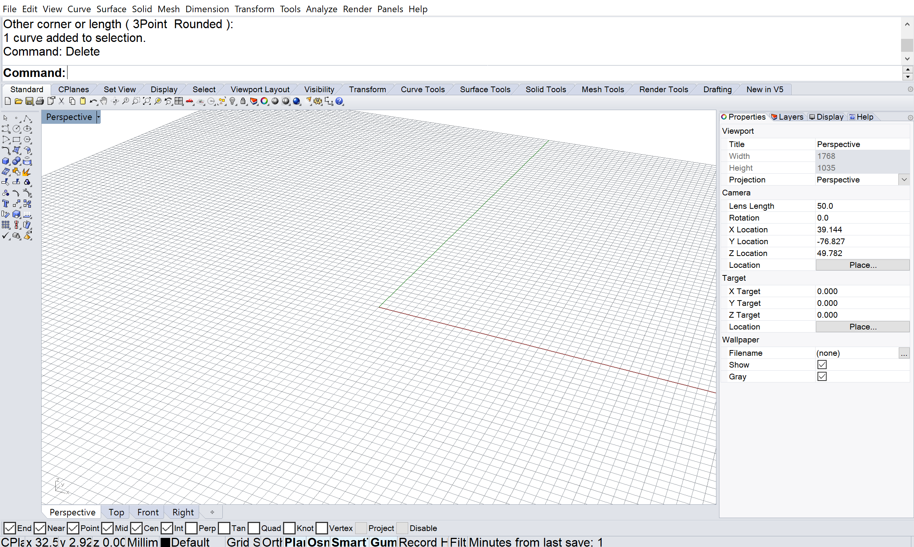
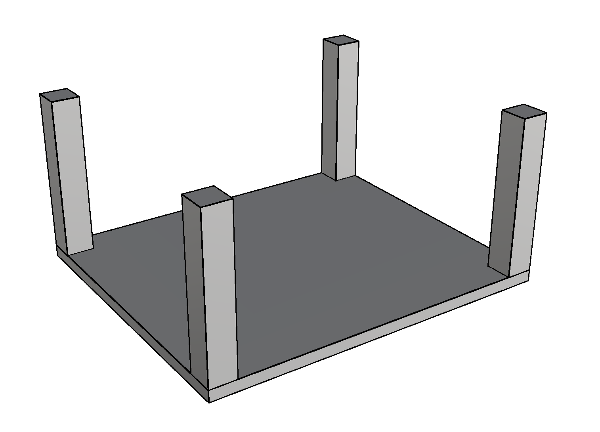
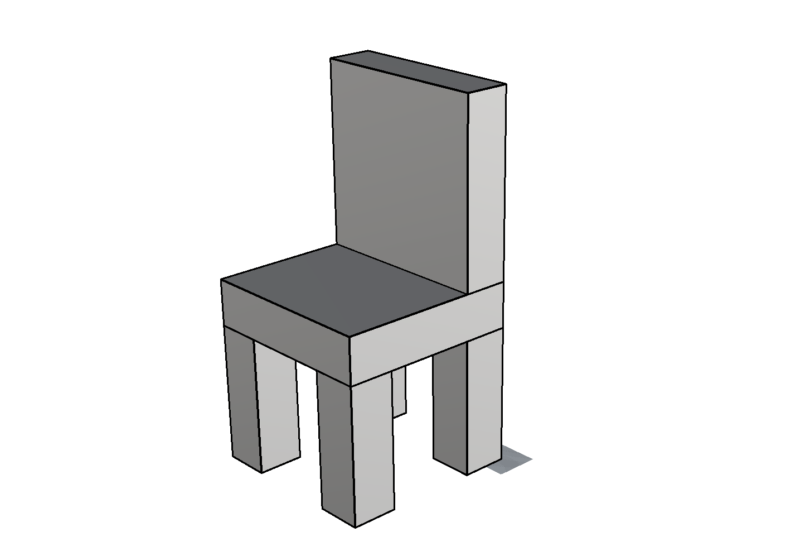

# CAD 図法演習Ⅰ（前期） 第02回

## 本日の内容
- RhinocerosのUI（ユーザーインターフェース）を学ぶ
- コマンド入力の方法を学ぶ
- ボックスを使って椅子を作る

## RhinocerosのUI（ユーザーインターフェース）を学ぶ
- ナビゲーション
- 単位設定
- レイヤー
- プロパティ
- ツールバー
- スナップオプション

参考動画: [https://youtu.be/HRquyx1Mga8](https://youtu.be/HRquyx1Mga8)

## コマンド入力の方法を学ぶ
- 床を作る：【box】【distance】
- 柱を作る：【box】【mirror】【move】【copy】

参考動画: [https://youtu.be/0RuwjsEMzX0](https://youtu.be/0RuwjsEMzX0)

*英語版のRhinoceros 5を利用する前提です。*

## ボックスを使って椅子を作る
先に学んだコマンドを利用して椅子を作ってみる。

## 参考

- 出席フォーム: [https://goo.gl/forms/5cpNwSocL7hDmPlH3](https://goo.gl/forms/5cpNwSocL7hDmPlH3)
- Google Classroomのクラスコード：vb77fs
- 授業用のデータ置き場: [https://github.com/TUA2018-CAD-1/TUA2018_CAD_1_Repo](https://github.com/TUA2018-CAD-1/TUA2018_CAD_1_Repo)
- 授業用の参考動画のプレイリスト: [https://www.youtube.com/playlist?list=PLzRzqTjuGIDiCASLSc7DNeuCAcnJgjv6H](https://www.youtube.com/playlist?list=PLzRzqTjuGIDiCASLSc7DNeuCAcnJgjv6H)
