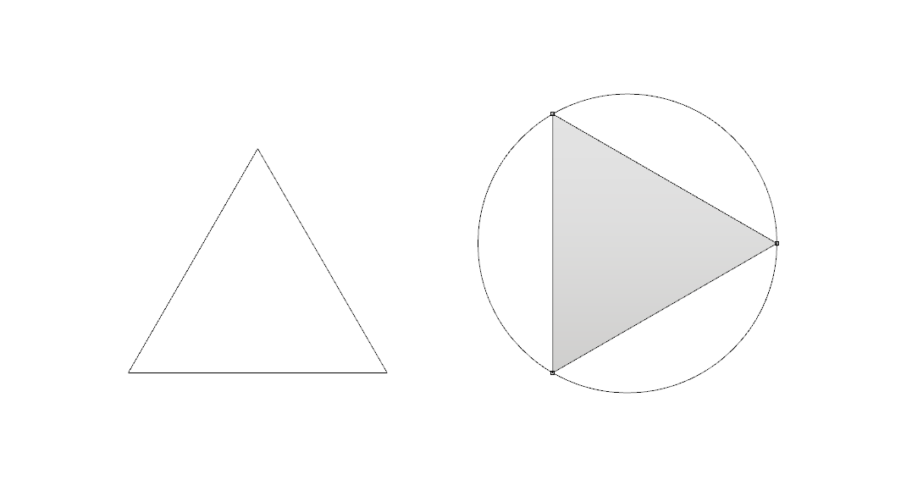
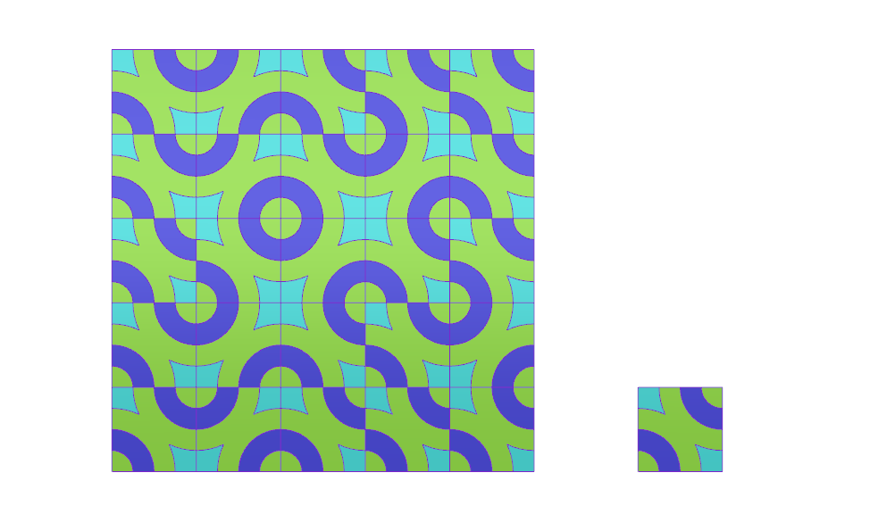

# CAD 図法演習Ⅰ（前期） 第03回

## 本日の内容
- 3角形の作り方を通して、２Dコマンドを学ぶ
- 演習：簡易パターンを描いてみる
- 応用演習：参考イメージパターンをトレースする

## 3角形の作り方を通して、２Dコマンドを学ぶ
- 色々な３角形の作り方
- ①[line] [rotate] [join] [planar srf]
- ②[circle] [divide] [polyline]
- ③[explode] [join]
- ④[offset]
- ⑤[points on]
- ⑥[fillet]
- ⑦[extend] [trim]
- ⑧ [scale]

## 演習：簡易パターンを描いてみる
- [pt] [array] [curve] [interp crv] [handle curve] [sketch]
  [planar srf] [split]

## 応用演習：参考イメージパターンをトレースする
- [picture frame]で参考イメージを配置する

## 参考

- 出席フォーム: [https://goo.gl/forms/5cpNwSocL7hDmPlH3](https://goo.gl/forms/5cpNwSocL7hDmPlH3)
- Google Classroomのクラスコード：vb77fs
- 授業用のデータ置き場: [https://github.com/TUA2018-CAD-1/TUA2018_CAD_1_Repo](https://github.com/TUA2018-CAD-1/TUA2018_CAD_1_Repo)
- 授業用の参考動画のプレイリスト: [https://www.youtube.com/playlist?list=PLzRzqTjuGIDiCASLSc7DNeuCAcnJgjv6H](https://www.youtube.com/playlist?list=PLzRzqTjuGIDiCASLSc7DNeuCAcnJgjv6H)
