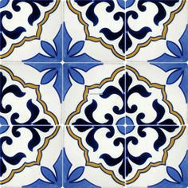
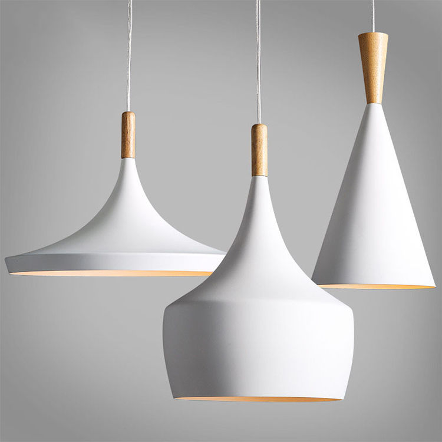
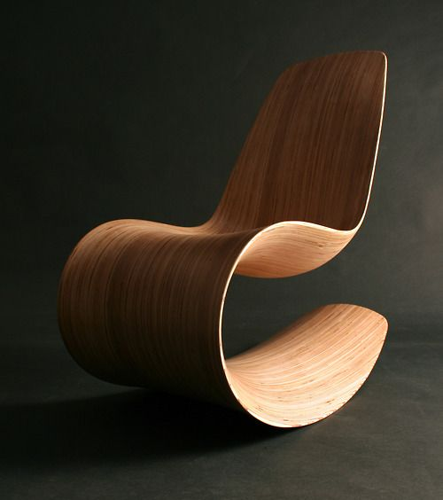

# CAD 図法演習Ⅰ（前期） 第04回

## 本日の内容
- 前回の応用演習
- テーブルを作る（四角形状）
- 照明を作る（曲面形状）
- 応用演習：指定の椅子を作ってみる

## 前回の応用演習
- 参考イメージの配置： 【Pictureframe】
- 画像のトレース：【Distance】【Rectangle】【Arc】【Line】【Curve】【Join】【Mirror】【Trim】【Planarsrf】【Split】【Copy】

参考動画：[https://youtu.be/tnG59uwj_fo](https://youtu.be/tnG59uwj_fo)

## 照明を作る（曲面形状）

- Gridスナップを使う
- 断面図を描く：【Curve】【Join】【Line】
- シェードを作る：【Revolve】
- Projectの使い方
- Closed / Open Polysurfaceとは
- 電球その他を作る：【Circle】【PlanarSrf】【ExtrudeSrf】【Trim】【BooleanDifference】【BooleanDifference】【Sphere】

参考動画: [https://youtu.be/Yf8556YqyKA](https://youtu.be/Yf8556YqyKA)

## 応用演習：指定の椅子を作ってみる
先に学んだコマンドを利用して椅子を作ってみる。

## 出席・参考

- 出席フォーム: [https://goo.gl/forms/5cpNwSocL7hDmPlH3](https://goo.gl/forms/5cpNwSocL7hDmPlH3)
- Google Classroomのクラスコード：vb77fs
- 授業用のデータ置き場: [https://github.com/TUA2018-CAD-1/TUA2018_CAD_1_Repo](https://github.com/TUA2018-CAD-1/TUA2018_CAD_1_Repo)
- 授業用の参考動画のプレイリスト: [https://www.youtube.com/playlist?list=PLzRzqTjuGIDiCASLSc7DNeuCAcnJgjv6H](https://www.youtube.com/playlist?list=PLzRzqTjuGIDiCASLSc7DNeuCAcnJgjv6H)
