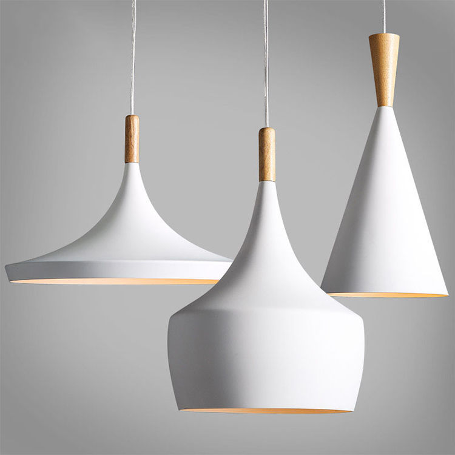
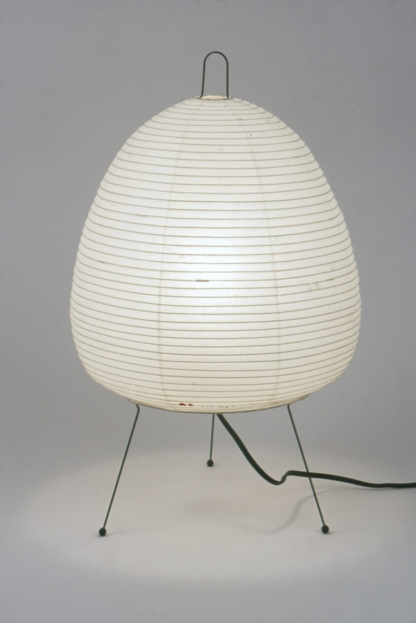
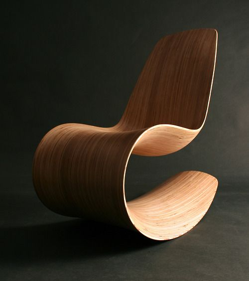
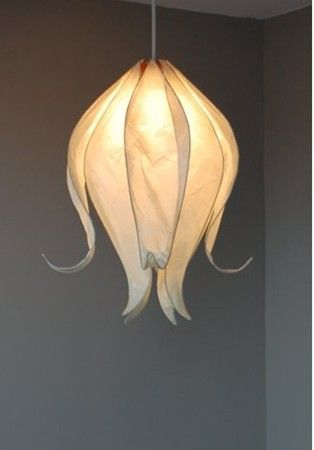

# CAD 図法演習Ⅰ（前期） 第05回

## 本日の内容
- 前回作った照明を別のコマンドで作ってみる
- 複雑な曲面の照明を作る
- 応用演習1：指定の椅子を作ってみる
- 応用演習2：指定の照明を作ってみる
   

## 前回作った照明を別のコマンドで作ってみる
- 使用コマンド：【NetworkSrf】【Loft】

## 複雑な曲面の照明を作る
- 使用コマンド：【CageEdit 】【Trim 】【Contour 】【Extrude Crv】【Intersect 】【Split】　　
              【Scale 2D】【Sweep1】【Sweep2】【Pipe】【OffsetSrf 】

## 応用演習1：指定の椅子を作ってみる
- ヒントコマンド：【Loft】【NetworkSrf】

## 応用演習2：指定の照明を作ってみる

- 写真にある照明を自分で作ってみる。可能な限り再現すること。

## 参考

- 出席フォーム: [https://goo.gl/forms/5cpNwSocL7hDmPlH3](https://goo.gl/forms/5cpNwSocL7hDmPlH3)
- Google Classroomのクラスコード：vb77fs
- 授業用のデータ置き場: [https://github.com/TUA2018-CAD-1/TUA2018_CAD_1_Repo](https://github.com/TUA2018-CAD-1/TUA2018_CAD_1_Repo)
- 授業用の参考動画のプレイリスト: [https://www.youtube.com/playlist?list=PLzRzqTjuGIDiCASLSc7DNeuCAcnJgjv6H](https://www.youtube.com/playlist?list=PLzRzqTjuGIDiCASLSc7DNeuCAcnJgjv6H)
