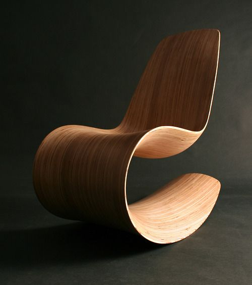
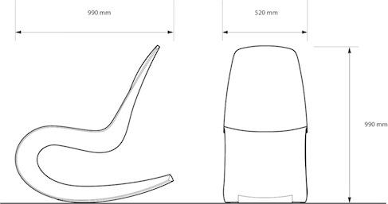
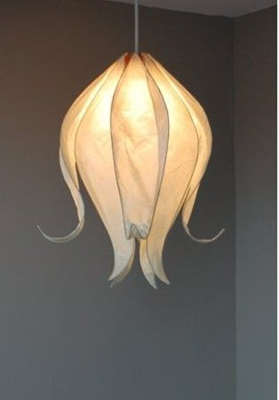
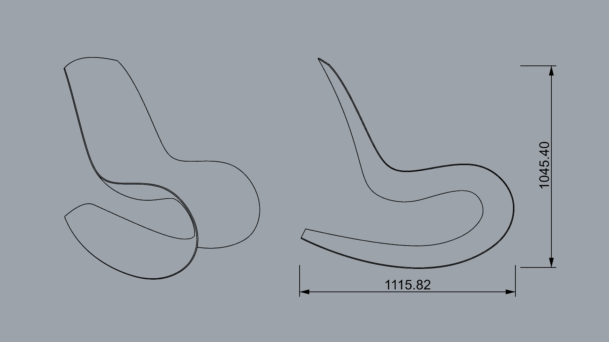

# CAD 図法演習Ⅰ（前期） 第06回

## 本日の内容
- 指定の椅子の作り方
- 指定の照明の作り方
- 図面の作り方
- 応用演習：自分の椅子と照明の図面を作る
   

## 指定の椅子の作り方
- 使用コマンド：【NetworkSrf】【Intersect】【Rotate3D】【InterpCrv】【Curve】【OffsetSrf】【ExtrudeCrv】【Split】【Mirror】【EditPtOn】

参考動画：[https://youtu.be/fep8PgUfcAE](https://youtu.be/fep8PgUfcAE)

## 指定の照明の作り方
- 使用コマンド：【Loft】【Mirror】【EditPtOn】【Rotate】【Curve】

参考動画：[https://youtu.be/2rFRjevS4UA](https://youtu.be/2rFRjevS4UA)

## 図面の作り方
- 使用コマンド：【Make2D】【Dim】

参考動画：[https://youtu.be/80ZAgdtSThA](https://youtu.be/80ZAgdtSThA)

## 応用演習：自分の椅子と照明の図面を作る
- ヒントコマンド：【Make2D】【Dim】

## 参考
- 出席フォーム: [https://goo.gl/forms/5cpNwSocL7hDmPlH3](https://goo.gl/forms/5cpNwSocL7hDmPlH3)
- Google Classroomのクラスコード：vb77fs
- 授業用のデータ置き場: [https://github.com/TUA2018-CAD-1/TUA2018_CAD_1_Repo](https://github.com/TUA2018-CAD-1/TUA2018_CAD_1_Repo)
- 授業用の参考動画のプレイリスト: [https://www.youtube.com/playlist?list=PLzRzqTjuGIDiCASLSc7DNeuCAcnJgjv6H](https://www.youtube.com/playlist?list=PLzRzqTjuGIDiCASLSc7DNeuCAcnJgjv6H)
