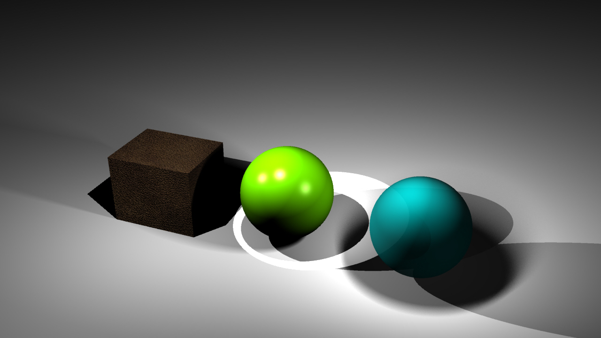

# CAD 図法演習Ⅰ（前期） 第07回

## 本日の内容
- 複雑な曲面の照明を作る(続き)
- レンダリング
- 応用演習１：照明のレンダリング
   

## 複雑な曲面の照明を作る(続き)
- 使用コマンド：【CageEdit 】【Trim 】【Contour 】【Extrude Crv】【Intersect 】【Split】　　
              【Scale 2D】【Sweep1】【Sweep2】【Pipe】【OffsetSrf 】

　  
　  

## レンダリング
- マテリアルの設定　　　　　
- ライトの作成　

## 応用演習1：照明のレンダリング
- モデリングの続き
- 本日モデリングした照明モデルにマテリアルを入れて、レンダリングする

## 参考

- 授業用のデータ置き場: [https://github.com/TUA2018-CAD-1/TUA2018_CAD_1_Repo](https://github.com/TUA2018-CAD-1/TUA2018_CAD_1_Repo)
- 授業用の参考動画のプレイリスト: [https://www.youtube.com/playlist?list=PLzRzqTjuGIDiCASLSc7DNeuCAcnJgjv6H](https://www.youtube.com/playlist?list=PLzRzqTjuGIDiCASLSc7DNeuCAcnJgjv6H)
