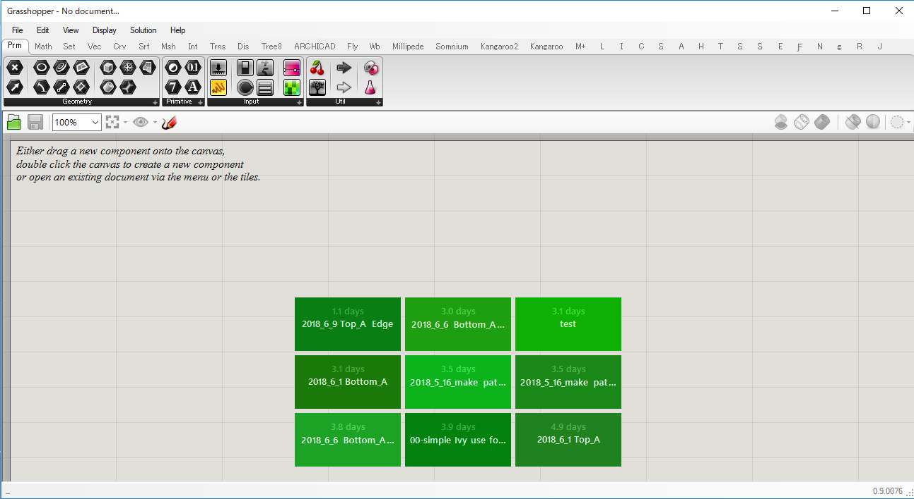
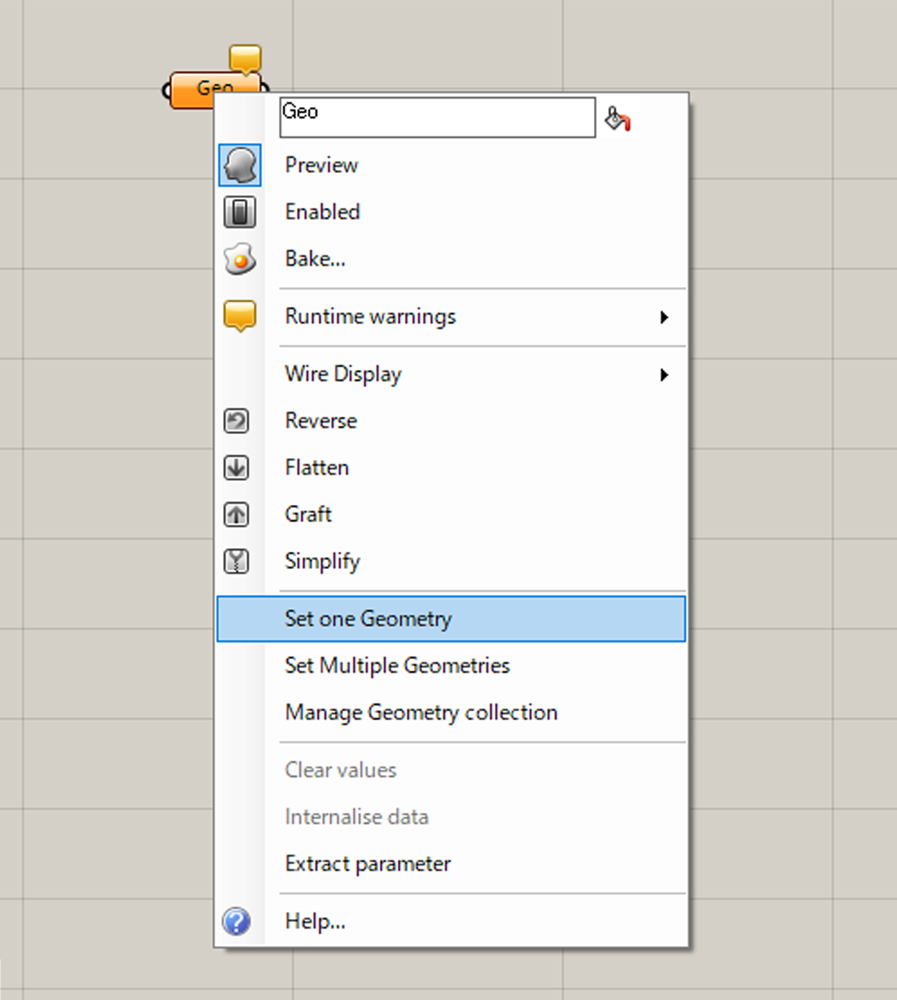
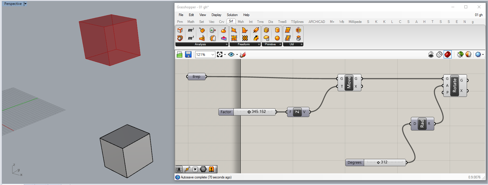

# CAD 図法演習Ⅰ（前期） 第09回

## 本日の内容
- グラスホッパーUI
- ライノモデルとの連動
- 移動、回転操作
- サーフェース　UV座標
   

## グラスホッパーUI
- 使用コマンド：【Grasshopper】

## ライノモデルとの連動
- 使用コンポーネント："Geometry"
　GH UI上でマウス左ダブルクリックで使用コンポーネント検索、または
　GH UI タブからドロップ

- RHデータとGHコンポーネントのリンク
　コンポーネント上でマウス左クリックで"Set One Geometry"または"Set Multiple Geometories"
　を選択し、続けてRH上でリンクしたいモデルを選択

## 移動、回転操作
- 使用コンポーネント："Move" "Rotate" "Unit X" "Number Slider" "Radians"

## サーフェース　UV座標
- 使用コンポーネント："Surface Frames" "Evaluate Surface" "Construct Point"

## 参考

- 出席フォーム: [https://goo.gl/forms/5cpNwSocL7hDmPlH3](https://goo.gl/forms/5cpNwSocL7hDmPlH3)
- Google Classroomのクラスコード：vb77fs
- 授業用のデータ置き場: [https://github.com/TUA2018-CAD-1/TUA2018_CAD_1_Repo](https://github.com/TUA2018-CAD-1/TUA2018_CAD_1_Repo)
- 授業用の参考動画のプレイリスト: [https://www.youtube.com/playlist?list=PLzRzqTjuGIDiCASLSc7DNeuCAcnJgjv6H](https://www.youtube.com/playlist?list=PLzRzqTjuGIDiCASLSc7DNeuCAcnJgjv6H)

