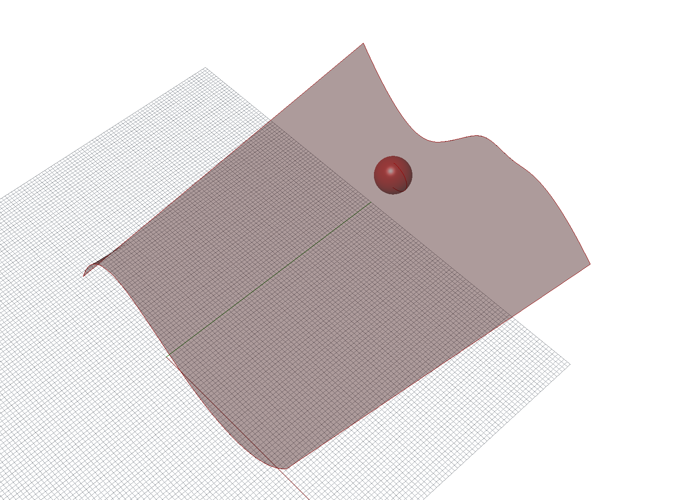
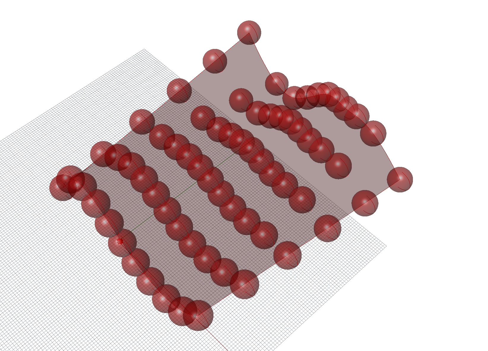
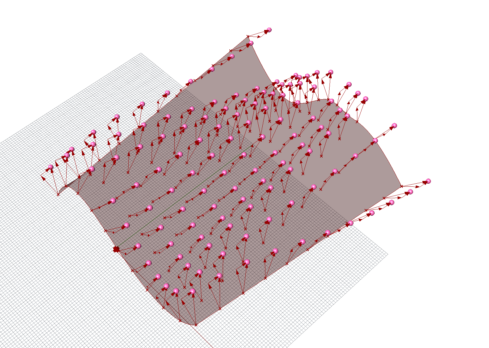
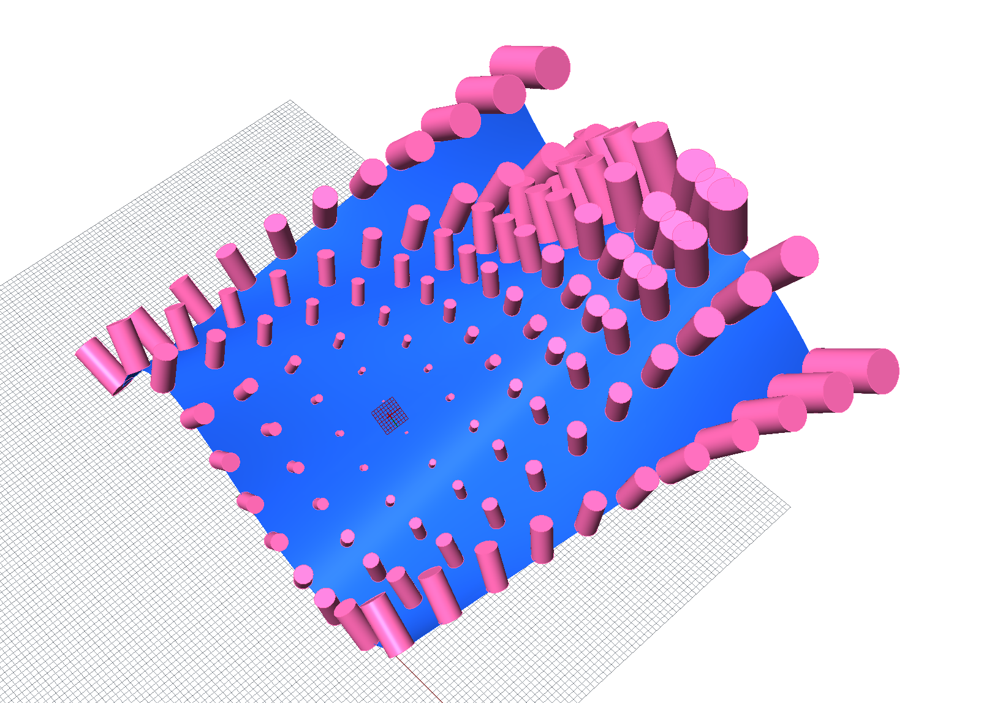

# CAD 図法演習Ⅰ（前期） 第10回

## 本日の内容
- アイテム
- リスト
- ベクトル基礎
- モデリング基礎
- 宿題
   

## アイテム
- 使用コンポーネント："Srf" "Evaluate Srf" "MD Slider"

参考動画: [https://youtu.be/-IByFzfDON8](https://youtu.be/-IByFzfDON8)

## リスト

- 使用コンポーネント："Number Slider" "Series" "Evaluate Srf" "Graft" "Flatten" "Panel" "Construct Point"

参考動画: [https://youtu.be/TXgalJwENuk](https://youtu.be/TXgalJwENuk)

## ベクトル基礎
- 使用コンポーネント："Visualize Vector" "Amplitude" "Deconstruct Vector" "Add" "Subtract"

参考動画: [https://youtu.be/UqUzGx31eKE](https://youtu.be/UqUzGx31eKE)

## モデリング基礎
- 使用コンポーネント："Extrude" "Circle" "Unit Z"  "Unit X" "Orient" "Scale" "Distance" "Remap"

参考動画: [https://youtu.be/PKhCT4bA75g](https://youtu.be/PKhCT4bA75g)

## 宿題
サーフェース上に自分で作ったモデルを円柱の代わりに置いて、その際作ったRhinoファイル（3dm）とGrasshopperファイル（gh）とそのスクリーンショットを提出してください。

## 参考

- 出席フォーム: [https://goo.gl/forms/5cpNwSocL7hDmPlH3](https://goo.gl/forms/5cpNwSocL7hDmPlH3)
- Google Classroomのクラスコード：vb77fs
- 授業用のデータ置き場: [https://github.com/TUA2018-CAD-1/TUA2018_CAD_1_Repo](https://github.com/TUA2018-CAD-1/TUA2018_CAD_1_Repo)
- 授業用の参考動画のプレイリスト: [https://www.youtube.com/playlist?list=PLzRzqTjuGIDiCASLSc7DNeuCAcnJgjv6H](https://www.youtube.com/playlist?list=PLzRzqTjuGIDiCASLSc7DNeuCAcnJgjv6H)

