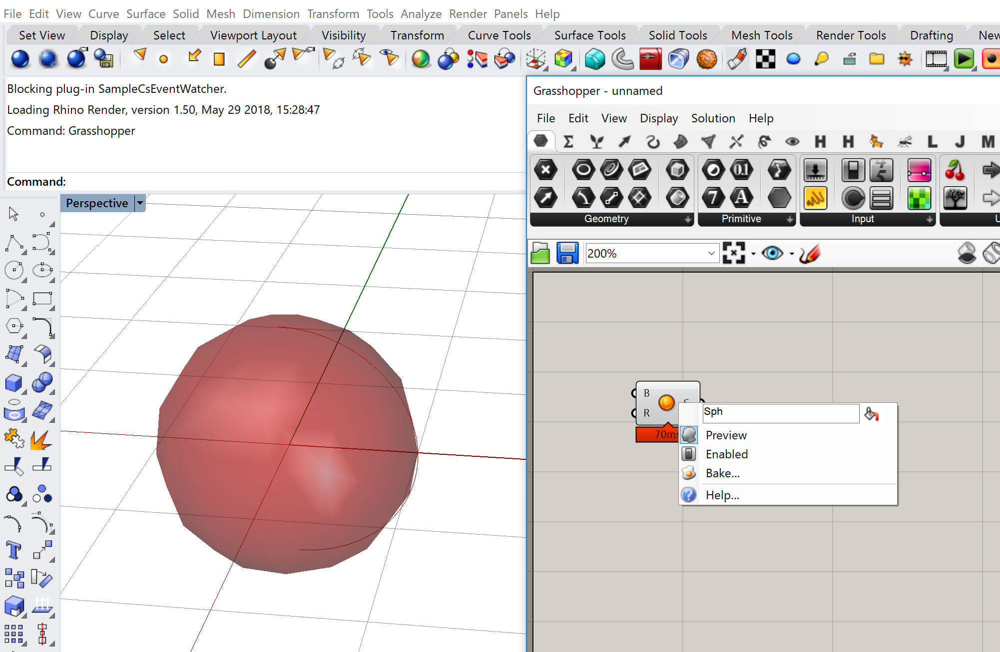
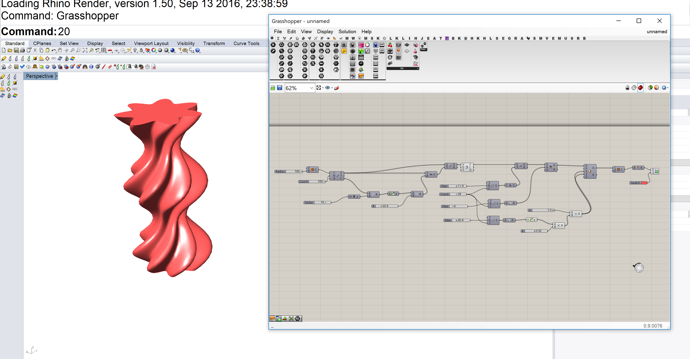
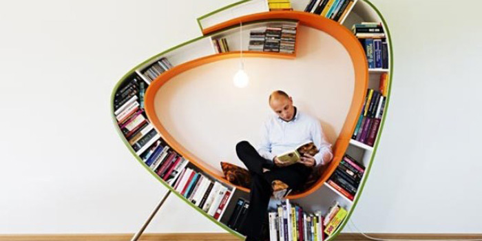
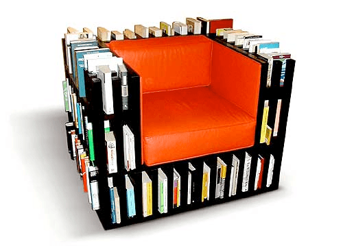
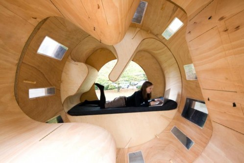
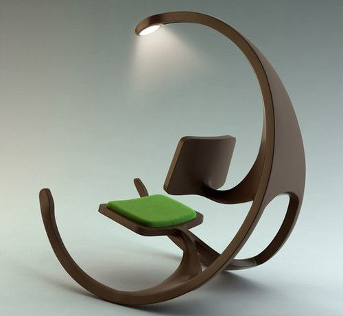

# CAD 図法演習Ⅰ（前期） 第12回

## 本日の内容

- GrasshopperモデルのBake（ベイク）
- Grasshopper実習
- 最終課題についてのお知らせ

## GrasshopperモデルのBake（ベイク）

コンポーネントのアイコンの部分で右クリックし、Bakeを選ぶとGrasshopperのモデルのをライノのモデルとして扱えるようになる。

## Grasshopper実習

ねじり柱を作る

参考動画： https://youtu.be/1VkvHr5SKJM

## 最終課題についてのお知らせ

### 課題内容

複数の機能を組み合わせた家具を作る。

- 例１）椅子＋本棚

- 例２）テーブル＋ベッド

- 例３）照明＋椅子

### 最終提出物

- ライノデータ　(thino5) ＋モデリング説明資料（使ったコマンドやモデリングフローの概要が分かるもの）をPDFで提出する。 *GHを使った場合はGHファイルも含める（GHへのインプットデータとレンダリングに使用した最終データ（GHからベイクしたもの）が分かるようにレイヤ分けすること）
- レンダリング　（画像データ１枚以上） *マテリアルやテクスチャを設定したもの
- 平面図、立面図、アイソメ図（make2D ）
- 7/24に発表してもらいます

### 来週までにやること

- どんな機能の組み合わせの家具を作りたいかを考えてくる。
- スケッチを描いてくる。

## 参考

- 出席フォーム: [https://goo.gl/forms/5cpNwSocL7hDmPlH3](https://goo.gl/forms/5cpNwSocL7hDmPlH3)
- Google Classroomのクラスコード：vb77fs
- 授業用のデータ置き場: [https://github.com/TUA2018-CAD-1/TUA2018_CAD_1_Repo](https://github.com/TUA2018-CAD-1/TUA2018_CAD_1_Repo)
- 授業用の参考動画のプレイリスト: [https://www.youtube.com/playlist?list=PLzRzqTjuGIDiCASLSc7DNeuCAcnJgjv6H](https://www.youtube.com/playlist?list=PLzRzqTjuGIDiCASLSc7DNeuCAcnJgjv6H)

